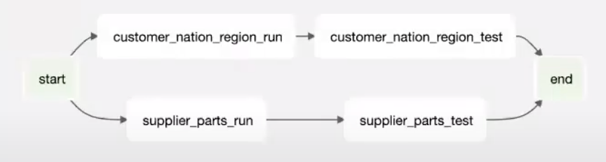
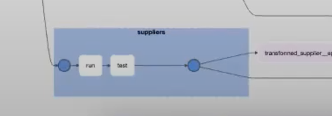
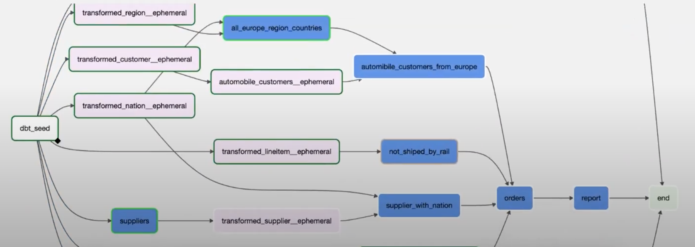
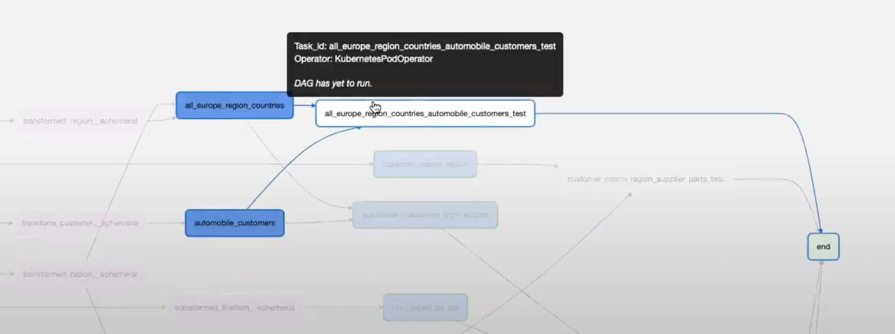
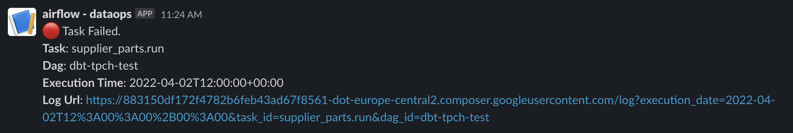
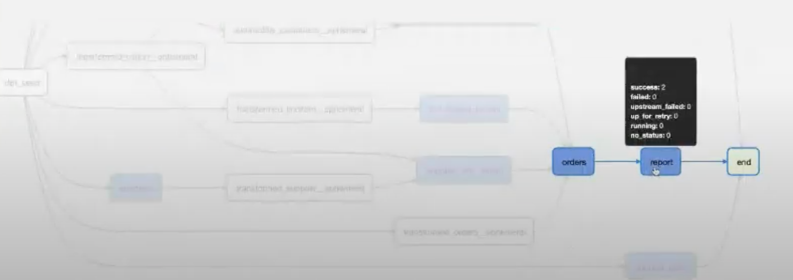

Features
-----

Building Airflow DAG
+++++++++++++++++++
**dbt-airflow-factory** main responsibility is parsing the DBT manifest file and creating a Graph of Airflow tasks.
For each model, the library creates pair of tasks: run and test. The first one is responsible for the execution
of transformations and the second one is for testing (``dbt run`` and ``dbt test`` commands).

Kubernetes as execution environment
+++++++++++++++++++
At the moment library supports only Kubernetes as an execution environment.
It is possible to use the same Kubernetes that Airflow is deployed on as well as an external one
(in the case of deployment with celery).

Tasks grouping
+++++++++++++++++++
Using the tool with Airflow 2.0 gives a possibility for grouping run and test tasks together.
It is done by TaskGroup Airflow functionality.

Hiding ephemeral models
+++++++++++++++++++
DBT introduces ephemeral models to reuse code but they are not executed on their own. That's why
usually it makes no sense to present them in Airflow. The library allows disabling them from rendering.

The above picture presents ephemeral tasks colored pink. Enabling hiding will cause all of the pink rectangles to disappear.

Tests depending on multiple models
+++++++++++++++++++
Some tests that are written in the tests directory may be executed on multiple models and they don't
have a clear connection to any of them. The library detects it automatically and creates separate Airflow
tasks for these tests.

Dynamically resolvable configuration
+++++++++++++++++++
Most of the configuration used by the library is subject to be resolved during execution. You can use `Airflow template variables <https://airflow.apache.org/docs/apache-airflow/stable/templates-ref.html#variables>`_
in your ``dbt.yml`` and ``k8s.yml`` files, as long as they are inside quotation marks:

.. code-block:: yaml

 target: "{{ var.value.env }}"
 some_other_field: "{{ ds_nodash }}"

Analogously, you can use ``"{{ var.value.VARIABLE_NAME }}"`` in ``airflow.yml``, but only the Airflow variable getter.
Any other Airflow template variables will not work in ``airflow.yml``.

Notifications
+++++++++++++++++++
It is possible to configure notifications in case of task failure. Currently, the only available channel is Slack.

Source dependencies
+++++++++++++++++++
Dividing the DBT project into smaller pieces or using data produced by other teams usually needs to wait for
data to be ready before our transformation will be executed. It is possible to use sources with metadata
to create Airflow sensors for other DAGs. Sensors will wait for these DAGs to finish before dependencies
will be executed.

The below picture presents upstream DAG created by Team A. Team A exposes data prepared by ``report`` task.

The following picture presents DAG that belongs to Team B that needs to use data created by Team A and extend it with their internal products.

.. image:: images/downstream.png
   :width: 600

